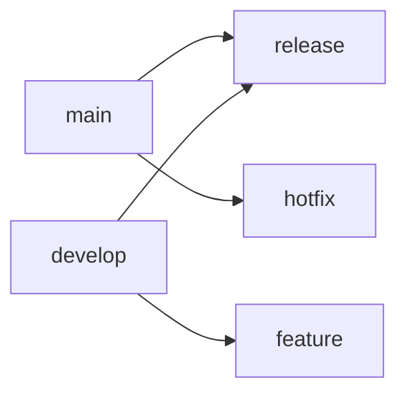
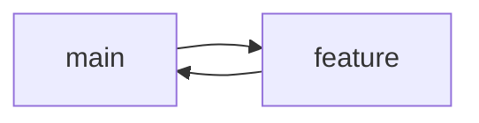
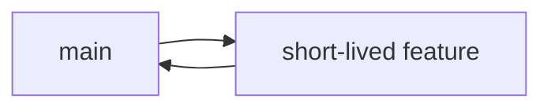

# Ultimate Git/GitHub Master Reference

```diff
+ Legend: [🔹Basic] [🔸Intermediate] [🔺Advanced]
```
### Repository Management

# Repository Management Commands

## Initialization & Cloning
| Command | Example | Explanation |
|---------|---------|-------------|
| `git init` | `git init` | Creates new Git repository in current directory (creates .git folder) |
| `git init <dir>` | `git init my-project` | Creates new Git repo in specified directory |
| `git clone <url>` | `git clone https://github.com/user/repo.git` | Downloads entire repository from remote URL |
| `git clone <url> <dir>` | `git clone https://... project-folder` | Clones repo into specified directory name |

## Configuration
| Command | Example | Explanation |
|---------|---------|-------------|
| `git config --global user.name` | `git config --global user.name "John Doe"` | Sets global username for all commits |
| `git config --global user.email` | `git config --global user.email "john@example.com"` | Sets global email for all commits |
| `git config --list` | `git config --list` | Shows all current Git configurations |

## Repository Inspection
| Command | Example | Explanation |
|---------|---------|-------------|
| `git status` | `git status` | Shows working tree status (staged/unstaged files) |
| `git log` | `git log` | Displays commit history |
| `git log --oneline` | `git log --oneline` | Shows compact commit history |
| `git remote -v` | `git remote -v` | Lists all configured remote repositories |

## Advanced Cloning Options
| Command | Example | Explanation |
|---------|---------|-------------|
| `git clone --depth <n>` | `git clone --depth 1 https://...` | Shallow clone (only last n commits) |
| `git clone --branch <name>` | `git clone --branch dev https://...` | Clones specific branch only |
| `git clone --single-branch` | `git clone --single-branch https://...` | Clones only one branch's history |

## Repository Maintenance
| Command | Example | Explanation |
|---------|---------|-------------|
| `git gc` | `git gc` | Garbage collection (optimizes repository) |
| `git fsck` | `git fsck` | Verifies repository integrity |
| `git count-objects -v` | `git count-objects -v` | Counts unpacked objects and disk usage |

## Working with Remotes
| Command | Example | Explanation |
|---------|---------|-------------|
| `git remote add <name> <url>` | `git remote add upstream https://...` | Adds new remote repository |
| `git remote remove <name>` | `git remote remove upstream` | Removes remote reference |
| `git remote rename <old> <new>` | `git remote rename origin upstream` | Renames remote reference |

## Special Repository Types
| Command | Example | Explanation |
|---------|---------|-------------|
| `git init --bare` | `git init --bare my-repo.git` | Creates bare repository (no working directory) |
| `git clone --mirror` | `git clone --mirror https://...` | Creates exact mirror of remote repo |
| `git bundle create <file>` | `git bundle create repo.bundle HEAD main` | Packages repo into single file |

## Example Workflow
```bash
# Create new repository
mkdir my-project && cd my-project
git init

# Configure user
git config user.name "Developer"
git config user.email "dev@company.com"

# Add remote origin
git remote add origin https://github.com/user/repo.git

# Verify setup
git remote -v
git status
```

# Git Branching Strategies

## Core Concepts

### 1. Branch Types
- **Main/Master**: Production-ready code (protected)
- **Develop**: Integration branch for features
- **Feature**: Single feature development
- **Release**: Preparation for production
- **Hotfix**: Critical production fixes

### 2. Common Strategies
| Strategy | Description | Best For |
|----------|-------------|----------|
| **Git Flow** | Strict branching model | Complex release cycles |
| **GitHub Flow** | Simplified workflow | Continuous delivery |
| **Trunk-Based** | Single main branch | Small teams/CI/CD |

## Essential Commands

### 1. Basic Branch Operations
```bash
# List all branches (local)
git branch

# List all branches (including remote)
git branch -a

# Create new branch
git branch feature-auth

# Switch to branch
git checkout feature-auth

# Create and switch in one command
git checkout -b hotfix-123

# Delete branch (safe)
git branch -d old-feature

# Force delete branch
git branch -D abandoned-feature
```
### 2. Remote Branch Management

```bash
# Push branch to remote
git push origin feature-auth

# Track remote branch
git branch --set-upstream-to=origin/feature-auth

# Delete remote branch
git push origin --delete stale-branch

# Fetch all remote branches
git fetch --all
```
### 3. Branch Comparison

```bash
# Show differences between branches
git diff main..feature-auth

# See commit differences
git log main..feature-auth

# Check which branches contain a commit
git branch --contains abc123
```

## Practical Examples

### Example 1: Feature Branch Workflow
```bash
# Start new feature
git checkout -b feature-payment main

# Make changes and commit
git add payment.js
git commit -m "Add payment processing"

# Push to remote
git push -u origin feature-payment

# When ready, create PR and merge to main
```
### Example 2: Hotfix Branch
```
# Create from main
git checkout -b hotfix-login main

# Fix the issue
git add login.js
git commit -m "Fix login validation"

# Merge back to main
git checkout main
git merge hotfix-login
git push

# Also merge to develop if using Git Flow
git checkout develop
git merge hotfix-login
git push
```
### Example 3: Branch Cleanup
```bash
# List merged branches
git branch --merged main

# Delete all merged branches (except main)
git branch --merged main | grep -v "main" | xargs git branch -d

# Prune remote tracking branches
git remote prune origin
```
## Advanced Techniques

## 1. Branch Rebasing
```bash
# Rebase feature branch onto latest main
git checkout feature-auth
git rebase main

# Interactive rebase (last 3 commits)
git rebase -i HEAD~3
```

### 2. Branch Renaming
```bash
# Rename local branch
git branch -m old-name new-name

# Push renamed branch
git push origin -u new-name

# Delete old remote branch
git push origin --delete old-name
```

### 3. Worktrees (Parallel Development)
```bash
# Create separate worktree
git worktree add ../hotfix hotfix-456

# List worktrees
git worktree list

# Remove worktree
git worktree remove hotfix-456
```

### Branching Strategy Cheat Sheet
### Git Flow


### GitHub Flow



### Trunk-Based



## Pro Tips
### Naming Conventions:

---

- feature/ prefix for features

- fix/ prefix for bug fixes

- release/ prefix for releases
